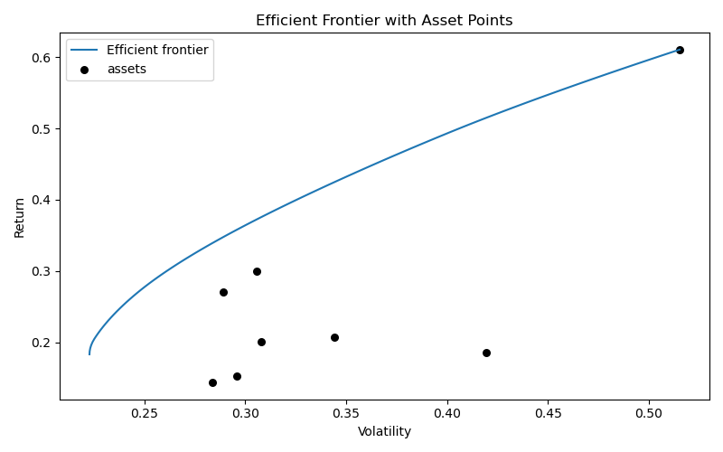
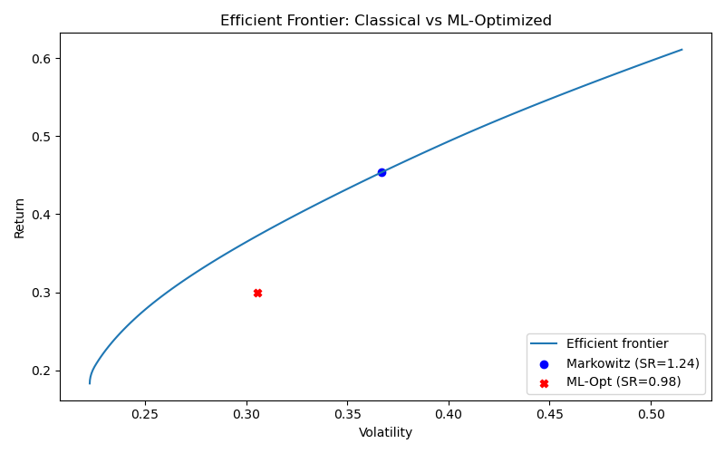

# 📈 Portfolio Optimization: Classical vs ML-Driven Strategies

This project compares traditional **Markowitz portfolio optimization** with a **machine learning-enhanced optimizer** using historical stock data. It demonstrates how predictive models can complement classical finance to construct portfolios with optimal risk-return tradeoffs.

## 🔍 Project Overview

We analyze and compare two strategies:

1. **Classical Markowitz Optimization**  
   Maximizes the Sharpe ratio using historical means and covariances.

2. **Machine Learning-Based Optimization**  
   Uses a Random Forest model to forecast next-day returns and optimizes accordingly.

## 🧠 Techniques Used

- **Efficient Frontier Construction** (via `PyPortfolioOpt`)
- **Return Forecasting** with `RandomForestRegressor` (via `Scikit-learn`)
- **Data Retrieval** from Yahoo Finance (`yfinance`)
- **Performance Visualization** using `matplotlib`
- **Modular Python scripting** and reusable utilities

---

## 🗂️ Project Structure

portfolio-optimizer/<br/>
│<br/>
├── data/                        # Saved raw price data <br/>
│   └── yfinance_prices_2018_2024.csv<br/>
│<br/>
├── results/                     # Outputs: plots & optimized weights<br/>
│   ├── markowitz_weights.csv<br/>
│   ├── ml_optimizer_weights.csv<br/>
│   ├── efficient_frontier.png<br/>
│   └── compare_frontier.png<br/>
│
├── scripts/                     # Modular Python scripts<br/>
│   ├── utils.py                 # Price download helper<br/>
│   ├── markowitz.py            # Classical optimizer<br/>
│   ├── ml_optimizer.py         # ML-based optimizer<br/>
│   ├── plot_frontier.py        # Frontier + asset point plot<br/>
│   ├── compare_strategies.py   # Final comparison plot<br/>
│   └── save_data_snapshot.py   # Saves downloaded raw data<br/>
│<br/>
├── requirements.txt            # Project dependencies<br/>
└── README.md                   # This file<br/>

---

## 📊 Sample Output

### Efficient Frontier with Asset Points  


### Strategy Comparison  


---

## 🏗️ How to Run

1. **Install requirements** (if not already):
   ```bash
   pip install -r requirements.txt

	2.	Generate historical price data:

python scripts/save_data_snapshot.py


	3.	Run optimizers:

python scripts/markowitz.py
python scripts/ml_optimizer.py


	4.	Plot efficient frontier and compare strategies:

python scripts/plot_frontier.py
python scripts/compare_strategies.py


⸻

📌 Requirements
	•	Python 3.8+
	•	pypfopt
	•	scikit-learn
	•	matplotlib
	•	pandas
	•	yfinance

You can install them via:

pip install pypfopt scikit-learn matplotlib pandas yfinance

⸻

📬 Future Work
	•	Add backtesting and performance metrics over time
	•	Incorporate transaction costs and turnover constraints
	•	Try other ML models (XGBoost, LSTM) for return forecasting
	•	Build interactive dashboard using Shiny or Dash
