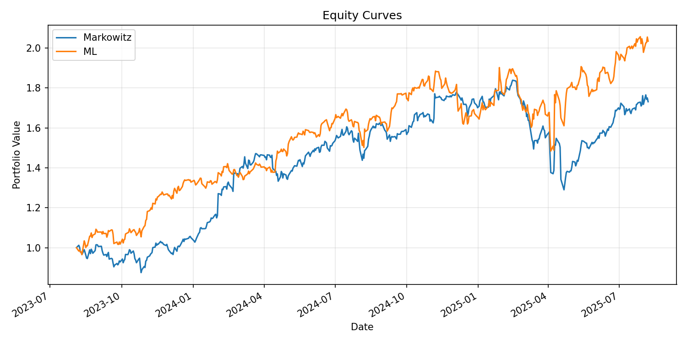

# 📈 Portfolio Optimization Engine: Markowitz vs ML-Driven Strategies

This project implements an **end-to-end portfolio optimization engine** that compares  
traditional **Markowitz mean-variance optimization** with a **machine learning–based strategy**  
using historical equity data and walk-forward backtesting.

It demonstrates how predictive models can complement classical finance to  
construct portfolios with improved risk-adjusted returns.

---

## 🔍 Project Overview

We compare two strategies over rolling time windows:

1. **Classical Markowitz Optimization**  
   - Maximizes Sharpe Ratio using historical mean returns and covariances  
   - Implemented via [`PyPortfolioOpt`](https://pyportfolioopt.readthedocs.io/)

2. **Machine Learning-Based Optimization**  
   - Uses a `RandomForestRegressor` to forecast next-day returns  
   - Allocates portfolio weights based on predicted returns  
   - Walk-forward evaluation to simulate real-time deployment

---

## 🧠 Techniques Used

- **Walk-Forward Backtesting** for realistic performance measurement
- **Efficient Frontier Construction** (`PyPortfolioOpt`)
- **Return Forecasting** with Random Forest (`scikit-learn`)
- **Robust Covariance Estimation** with NaN/outlier handling
- **Data Retrieval** from Yahoo Finance (`yfinance`)
- **Performance Metrics:** Sharpe Ratio, CAGR, Maximum Drawdown
- **Side-by-Side Equity Curve Visualization** (`matplotlib`)

---

## 🗂️ Project Structure

```

Portfolio\_Optimization\_Engine/
│
├── data\_loader.py          # Price download & cleaning
├── optimizer.py            # Markowitz optimization logic
├── models.py               # ML model training & prediction
├── backtester.py           # Walk-forward backtesting engine
├── main.py                 # Orchestrates full pipeline
├── run\_all.sh              # Smoke tests & quick checks
│
├── results/                # Output plots & logs
│   ├── equity\_comparison.png
│   ├── markowitz\_weights.csv
│   └── ml\_optimizer\_weights.csv
│
├── requirements.txt
└── README.md

````

---

## 📊 Example Results

**Backtest Period:** 2023-08-04 → 2025-08-07  

| Strategy    | Sharpe Ratio | CAGR   | Max Drawdown |
|-------------|--------------|--------|--------------|
| Markowitz   | 1.19         | 31.39% | -29.85%      |
| ML Forecast | 1.44         | 42.40% | -21.97%      |

**Equity Curve Comparison:**  


---

## 🏗️ How to Run

1. **Install dependencies:**
   ```bash
   pip install -r requirements.txt
   ```

2. **Run the full pipeline:**

   ```bash
   python main.py
   ```

3. **Run quick smoke tests:**

   ```bash
   ./run_all.sh
   ```

---

## 📦 Requirements

* Python 3.11+
* `pypfopt`
* `scikit-learn`
* `matplotlib`
* `pandas`
* `yfinance`

Install all with:

```bash
pip install pypfopt scikit-learn matplotlib pandas yfinance
```

---

## 📬 Future Work

* Add **multi-horizon evaluation** (1-year, 3-year, 5-year returns)
* Incorporate **transaction costs & turnover constraints**
* Experiment with other ML models (XGBoost, LSTM)
* Build interactive dashboards with **Shiny** or **Dash**
